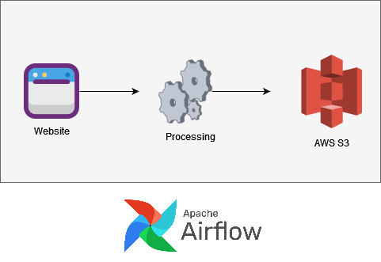
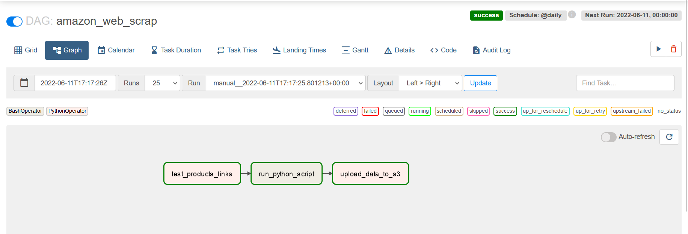
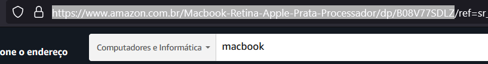
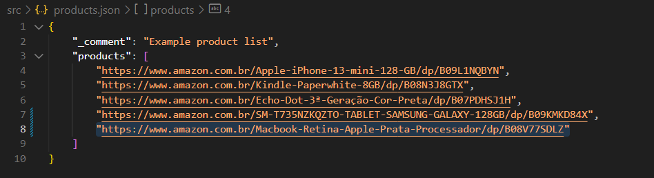

Amazon Price Web Scrap
=============
Collect Historical Price Data From Amazon


Table of Contents
-----------------

-   [Project Background](#project-background)
-   [Install & Setup](#install-&-setup)
-   [Usage](#usage)
-   [Authors](#authors)
-   [License](#license)


Project Background
----------
Pipeline:
<br>

<br>
DAG:
<br>


Collect historical price data for selected products in order to use it for analytical purposes.
Save price data on S3 and local file system.

Objective: show to a client the variation of price about one or more product.

There will have data analysis with the data collected coming soon. Straight from S3, the data will be analyzed with Pandas and Matplotlib.

Install & Setup
---------------
```html 
git clone https://github.com/ccallazans/price-web-scraping.git
cd price-web-scraping
```
Edit docker-compose file on /airflow/docker-compose.yaml with credentials
```
AWS_ACCESS_KEY_ID: ''
AWS_SECRET_ACCESS_KEY: ''
AWS_DEFAULT_REGION: ''
AWS_S3_BUCKET_NAME: ''
```
On ~/price-web-scraping/ folder run start.sh to create and run the containers.
```
bash start.sh
```
Wait until the containers load and access Airflow webserver on:
```
localhost:8080
```
Enter the following credentials:
```
username: airflow
password: airflow
```
On DAGs page, use the following dag: "amazon_web_scrap"


Usage
-----

It can be used to collect the data from a list of links. Use the "src/products.json" file to edit these links.<br>
Add another line on the file the product link. Ex:
<br>

<br><br>



Authors
-------

* Ciro Callazans | [@ccallazans](https://github.com/ccallazans)
* Leonardo José C. Pedreira Gama | [@Leonardopedreira](https://github.com/Leonardopedreira)


License
-------

[MIT License](LICENSE)
